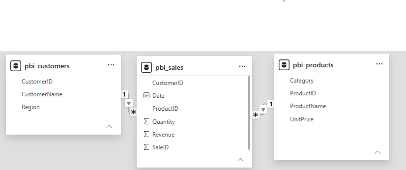

# Power BI Data Model — Sales Star Schema 📊

A Power BI data model built for sales reporting. This project shows the foundation skills behind every dashboard: loading data, cleaning it in Power Query, and modeling multiple tables into a **star schema** with one-to-many relationships.

## 📋 The scenario

A company wants a reliable model to report on sales by product and customer. Instead of one flat table, the data is modeled properly: a central **fact** table (Sales) surrounded by **dimension** tables (Products, Customers) — a star schema.

## 🗂️ The tables

| Table | Type | Role |
|-------|------|------|
| **pbi_sales** | Fact | One row per sale — the numbers you measure (Quantity, Revenue) |
| **pbi_products** | Dimension | Product context (ProductName, Category, UnitPrice) |
| **pbi_customers** | Dimension | Customer context (CustomerName, Region) |

## 🔗 The relationships (star schema)

- **pbi_products (1) → pbi_sales (many)** — one product appears in many sales
- **pbi_customers (1) → pbi_sales (many)** — one customer has many sales

Both are **one-to-many**: the dimension is the "one" side, the Sales fact is the "many" side. Filter direction is **single** — the dimensions filter the fact (pick a product or region and the sales numbers respond).

## 🧹 How the data was prepared (Power Query)

Each table was loaded with **Get Data** and shaped in **Power Query**: promoting the first row to headers, setting correct data types, and removing junk columns/duplicates. Every change is saved as an **Applied Step** — a reusable recipe that re-runs when the data refreshes.

## 🖼️ The Model (star schema)

## 🧰 Built with

- **Power BI Desktop** — Power Query (clean/shape) + Model view (relationships)
- **Star-schema data modeling** — fact & dimension tables, one-to-many relationships

## 💡 What this demonstrates

Before any chart can be built, the data has to be loaded, cleaned, and modeled correctly. This project shows I can do that foundational work in Power BI — the exact setup that powers dashboards and the Microsoft PL-300 certification.

---

**Author:** Felicia Soyinka · [LinkedIn](https://www.linkedin.com/in/felicia-soyinka)
