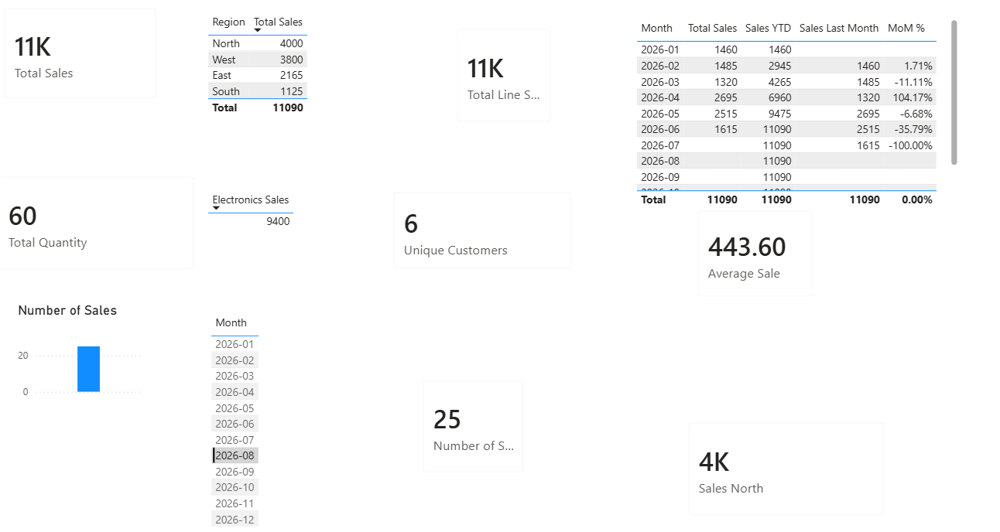

# DAX Measures Pack — Sales Analytics ⚡

A set of **DAX measures** built on a Power BI sales star-schema model. This project turns a clean data model into real business metrics — KPIs, filtered comparisons, and time intelligence (Year-to-Date and month-over-month growth).

## 📋 The scenario

Managers need key metrics from the sales model: headline KPIs, a regional/category cut, and time comparisons to see how the business is trending month to month and year to date.

## 🧮 The measures (and the DAX)

**Core KPIs (aggregations)**
| Measure | DAX | Answers |
|---------|-----|---------|
| Total Sales | `SUM(pbi_sales[Revenue])` | Total revenue |
| Total Quantity | `SUM(pbi_sales[Quantity])` | Total units sold |
| Average Sale | `AVERAGE(pbi_sales[Revenue])` | Average sale size |
| Number of Sales | `COUNTROWS(pbi_sales)` | How many sales |
| Unique Customers | `DISTINCTCOUNT(pbi_sales[CustomerID])` | How many different customers |

**Filtered comparisons (CALCULATE)**
| Measure | DAX | Answers |
|---------|-----|---------|
| Sales North | `CALCULATE(SUM(pbi_sales[Revenue]), pbi_customers[Region]="North")` | Sales for one region |
| Electronics Sales | `CALCULATE(SUM(pbi_sales[Revenue]), pbi_products[Category]="Electronics")` | Sales for one category |

**Row-by-row (SUMX + RELATED)**
| Measure | DAX | Answers |
|---------|-----|---------|
| Total Line Sales | `SUMX(pbi_sales, pbi_sales[Quantity] * RELATED(pbi_products[UnitPrice]))` | Revenue computed per line then summed |

**Time intelligence (Date table)**
| Measure | DAX | Answers |
|---------|-----|---------|
| Sales YTD | `TOTALYTD(SUM(pbi_sales[Revenue]), 'Date'[Date])` | Year-to-date total |
| Sales Last Month | `CALCULATE(SUM(pbi_sales[Revenue]), DATEADD('Date'[Date], -1, MONTH))` | Prior month's sales |
| MoM % | `DIVIDE([Total Sales] - [Sales Last Month], [Sales Last Month])` | Month-over-month growth % |

## 🖼️ The report

## 💡 What this demonstrates

- **Aggregation measures** for core KPIs
- **CALCULATE** to filter a calculation to one slice (region, category)
- **SUMX + RELATED** to calculate across related tables, row by row
- **Time intelligence** (YTD, month-over-month) using a proper Date table
- Understanding of **measures vs calculated columns** (live calculation vs stored per row)

These are the exact DAX skills behind real Power BI dashboards and the Microsoft PL-300 certification.

---

**Author:** Felicia Soyinka · [LinkedIn](https://www.linkedin.com/in/felicia-soyinka)
