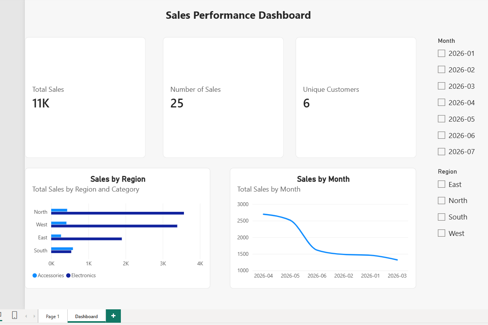

# Sales Performance Dashboard 📊

An interactive **Power BI dashboard** built on a sales star-schema model. It gives managers sales performance at a glance and lets them explore it by region and month. This project brings together the full Power BI skill set: data modeling, DAX measures, visuals, interactivity, and dashboard design.

## 📋 The business question

*"How is the business performing on sales — overall, by region, and over time, and where should we focus?"*

## 🖼️ The dashboard

## 🧩 What's on it (and why)

| Visual | Why this choice |
|--------|-----------------|
| **KPI cards** (Total Sales, Number of Sales, Unique Customers) | Headline numbers, placed top-left where the eye lands first |
| **Sales by Region** (bar chart, split by Category) | Bars are best for comparing categories; the legend adds the product-category mix |
| **Sales by Month** (line chart) | Lines are best for showing a trend over time |
| **Region & Month slicers** | Let users filter and explore the data themselves |

## 🖱️ How it's interactive

- **Slicers** — pick a region or month and the whole dashboard updates.
- **Cross-filtering** — click a bar and the other visuals filter to match; click blank space to clear.

## 💡 The key insight (data story)

Sales are strongest in the **North and West** regions, but the **monthly trend is declining** — so the business should investigate why sales are dropping over time before it worsens.

## 🧰 Built with

- **Power BI Desktop** — data model (star schema), DAX measures, visuals, slicers, formatting/theme
- Built on the Week 8 model + Week 9 DAX measures

## 🎯 What this demonstrates

The complete Power BI workflow — load & model data, write DAX, choose the right visuals, make it interactive, format it cleanly, and tell a clear story. This is the core of the Microsoft PL-300 certification and what most analyst roles want.

---

**Author:** Felicia Soyinka · [LinkedIn](https://www.linkedin.com/in/felicia-soyinka)
